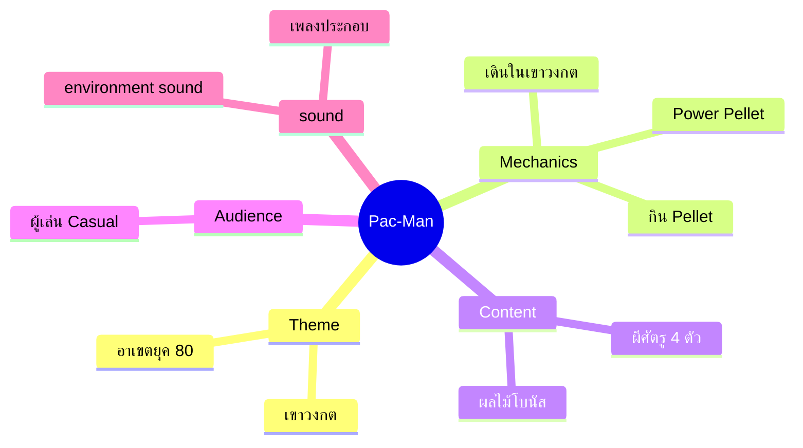
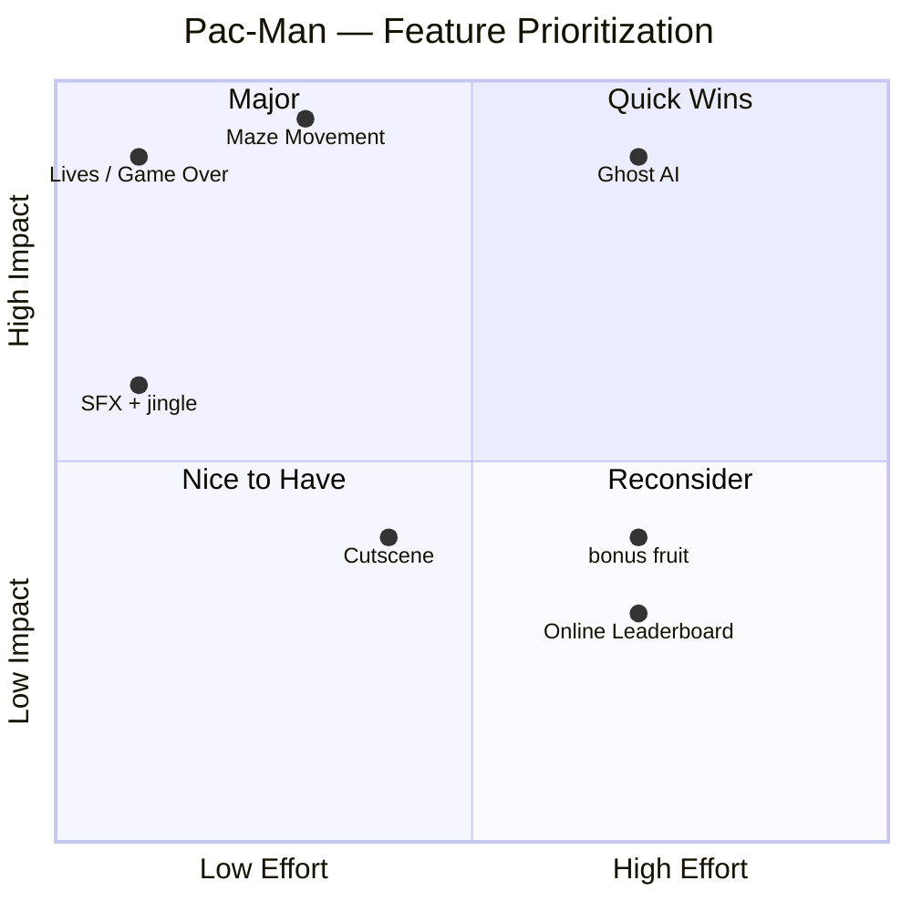
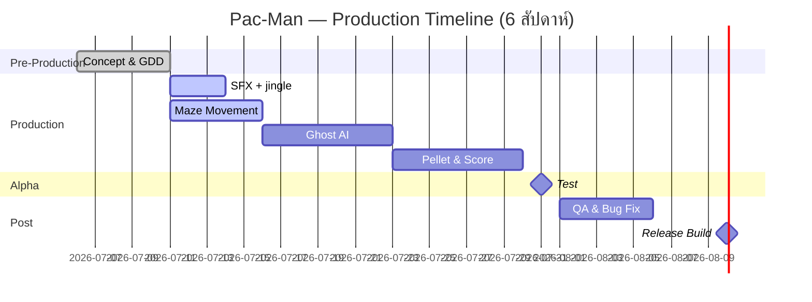

1. MVP -- Live / Game Over, SFX + jingle, Ghost AI, Maze Movement : สำคัญเพราะทำให้เกมสนุกและตื่นเต้น
2. ตัดออก -- Online Leaderboard, cutscrene, bonus fruit: ตัดออกเพราะไม่ได้สำคัญขนาดนั้นแต่ถ้ามีเวลาก็ทำได้

